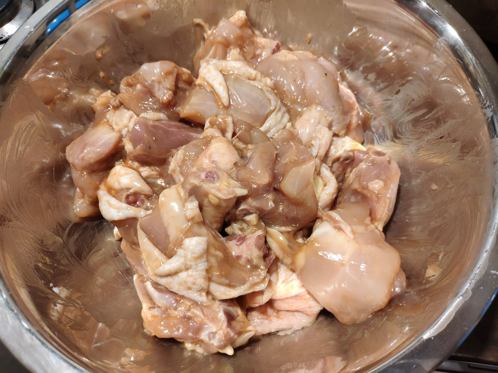

# 啤酒黄焖鸡

## 食材

鸡肉，香菇

## 调料

盐，糖，生抽，老抽，蚝油，料酒，啤酒，小葱，姜，大料，香叶，桂皮，白胡椒

## 步骤

1. 凉水泡香菇2小时（若时间有限可加热水泡30分钟）。

    

1. 鸡肉切块，开始码味儿：淀粉，生抽，老抽，料酒，白胡椒，盐。抓匀后腌制30-60分钟。

    

    

1. 切葱花姜片，取大料香叶桂皮备用。食材准备就绪。

    

1. 热锅凉油，加葱花姜片爆香，然后下鸡肉和大料香叶桂皮翻炒。

    

1. 紧接着上一步，加生抽、老抽、蚝油、料酒，翻炒至断生。

    

1. 香菇下锅，先加少量盐，翻炒均匀。

    

1. 加啤酒至没过食材（也可加入少量香菇水但以啤酒为主），大火烧开。开锅后加适量盐和白糖（糖比盐多）。此时不必尝味道，因为酒精还未挥发，味道不好。

    

    

1. 转中小火焖20-30分钟。

    

1. 切青椒，焖完后加入。

    

1. 此时可尝味道，取决于个人口味，可以适当加盐和糖。味道不宜过重，应为甘甜清爽。

1. 加入青椒后继续中火煮5-10分钟即可出锅。若不想保留汤汁，也可以大火收汁至粘稠，那么码味儿时注意要少放淀粉。

    

    

## 要领

- 啤酒选用普通工业啤酒即可（燕京、青岛、喜力等），精酿味道丰富但不一定适合做菜，比如有些高度啤酒可能会导致味道偏苦。具体什么酒最适合还有待考证。

- 食材还可以加土豆，用热水提前煮熟，在焖的阶段最后10分钟加入，可获得沙软口感。

- 调料还可以加辣椒，例如小米椒，切成长条不要太碎，在炒的阶段跟其他调料一起加入即可。

## 参考

- 步骤为原创。灵感来自大盘鸡、黄焖鸡和啤酒鸡。
