# 大盘鸡

## 食材

鸡肉，土豆，新疆线椒，青椒

## 调料

盐，白糖，大葱，姜，生抽，老抽，料酒，白胡椒，淀粉，花椒，花椒粉，郫县豆瓣酱，十三香

## 步骤

1. 鸡肉切成较大的块，码味儿：加料酒、盐、白胡椒、花椒粉、淀粉。

    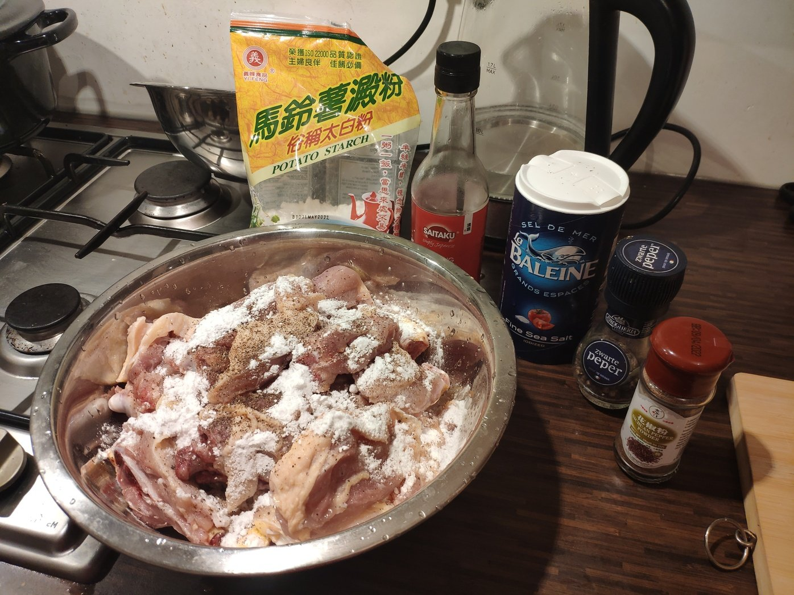

1. 用冷水泡新疆线椒。

    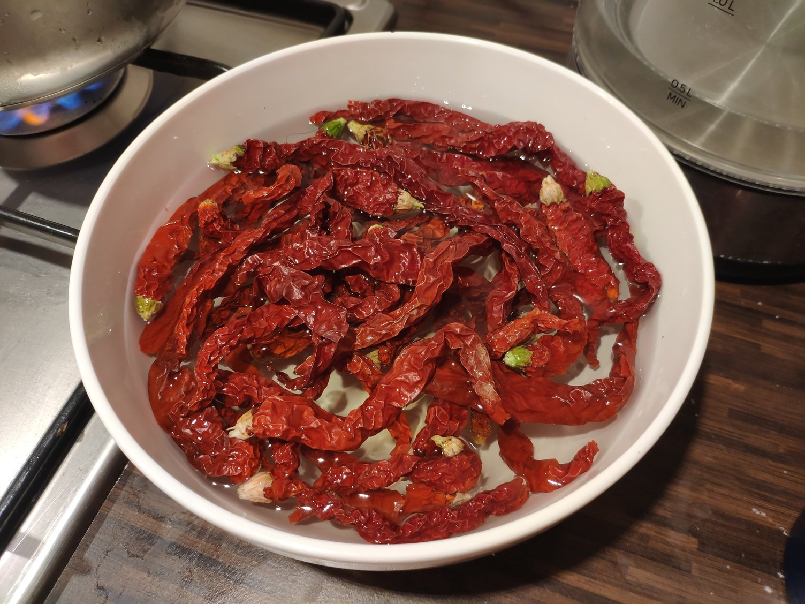

1. 准备葱、姜、花椒。大葱切成滚刀块，不宜太小。

    

1. [炒糖色](../技巧/炒糖色.MD)，加水取出备用。

    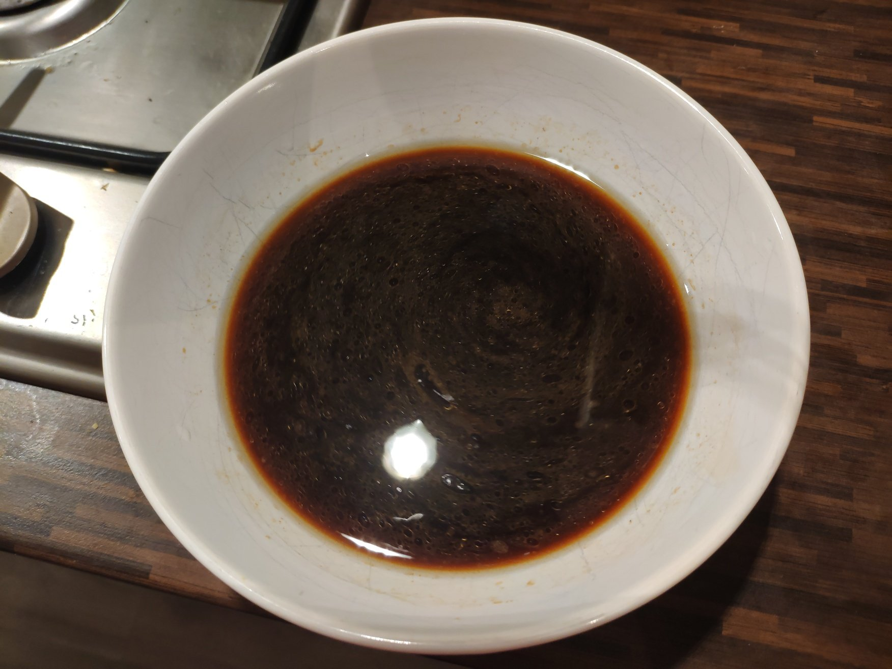

1. 土豆切成滚刀块，加水煮土豆，水中加入适量生抽、老抽给土豆上色。

    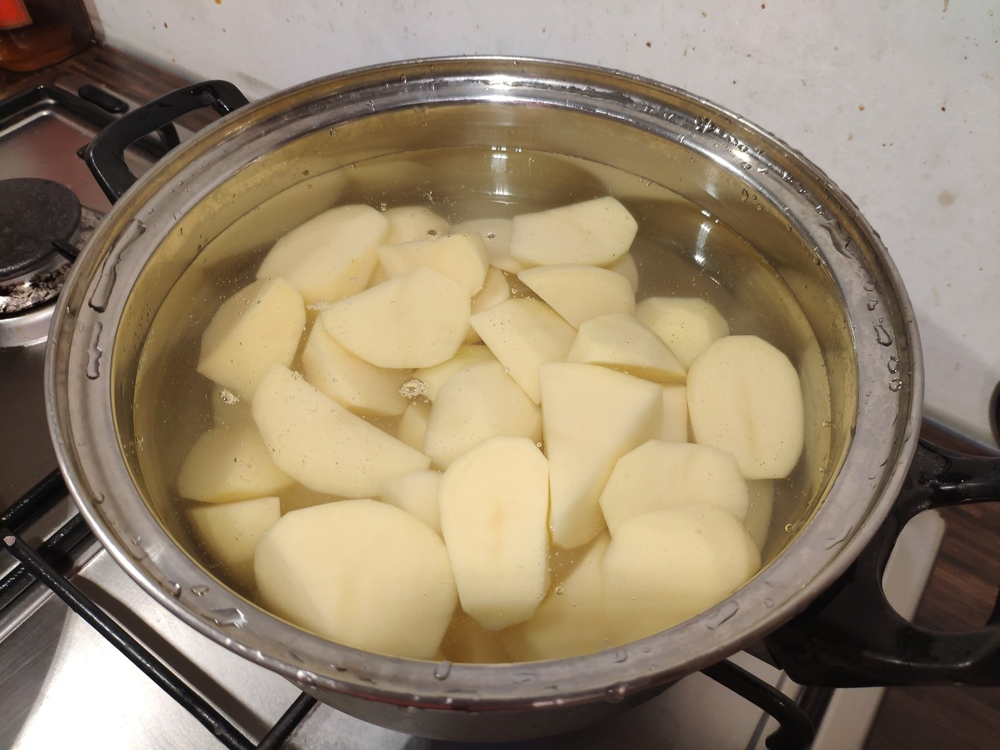

1. 起锅烧油，热锅凉油。加葱姜花椒爆香。然后加入腌好的鸡肉一起中火翻炒。

    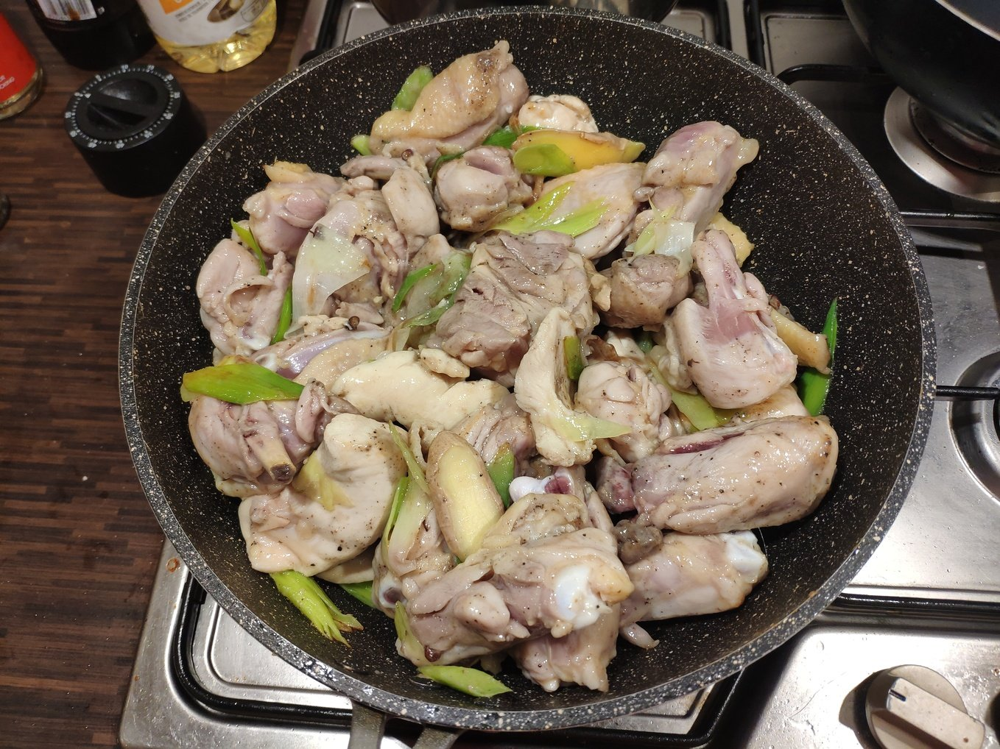

1. 鸡肉炒至断生后依次加入糖色、郫县豆瓣酱、花椒粉。继续翻炒。

    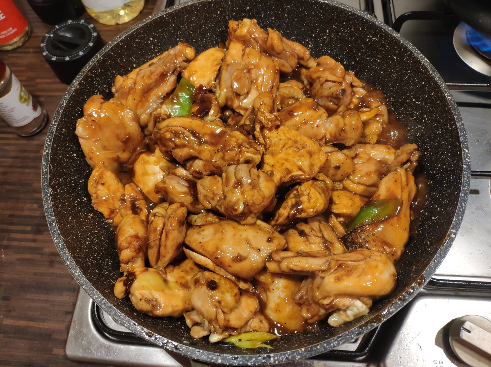

1. 炒至上色后，加开水至略高过食材。调味：加足量盐、十三香、生抽、豆瓣酱的红油。中小火煮10分钟左右。

    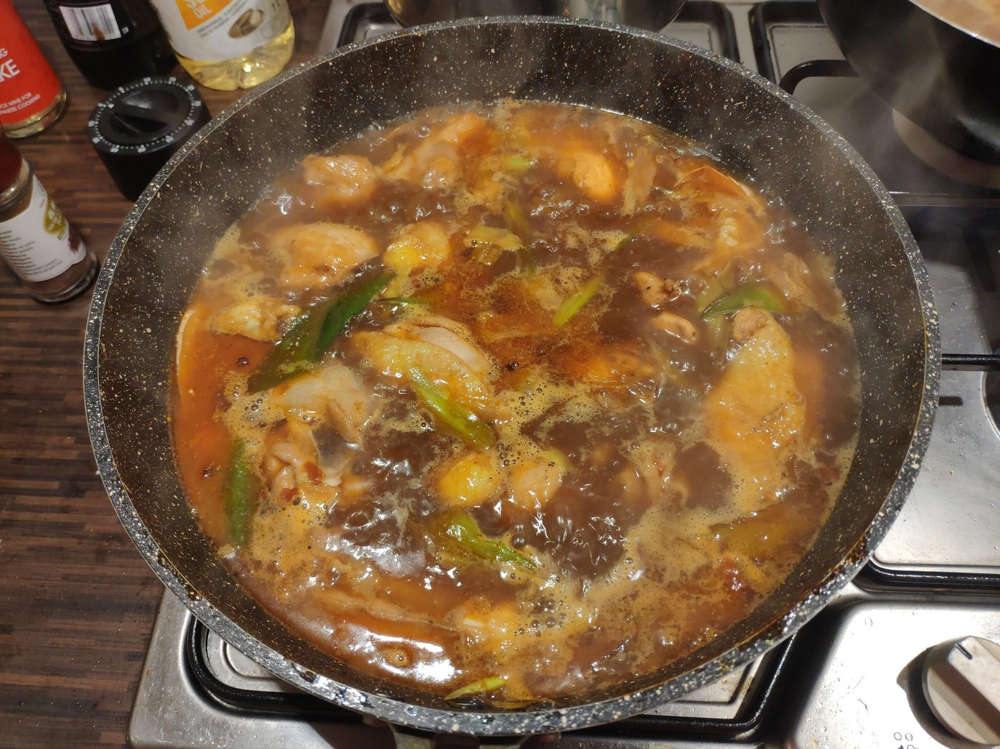

1. 加入新疆线椒，继续煮10分钟左右。

    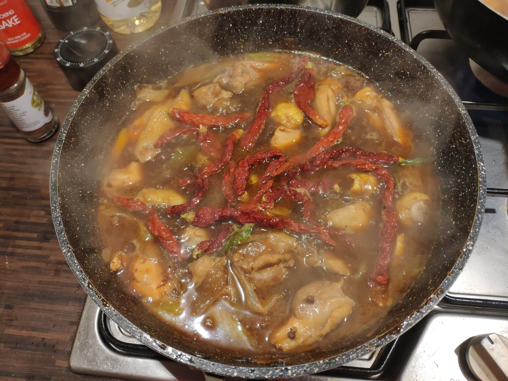

1. 准备蒜和青椒。蒜不要切太细，拍扁后简单切两刀即可。

    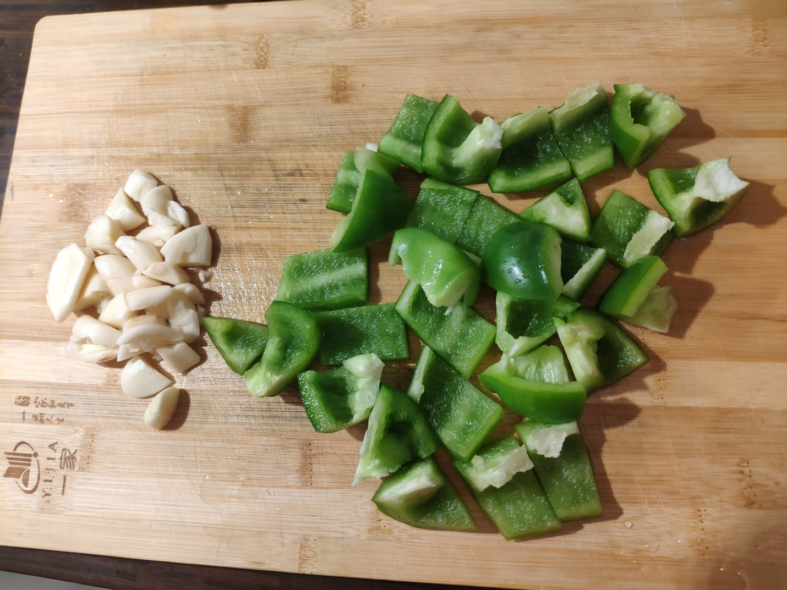

1. 汤汁略显粘稠时，加入煮软的土豆。继续煮5分钟左右。

    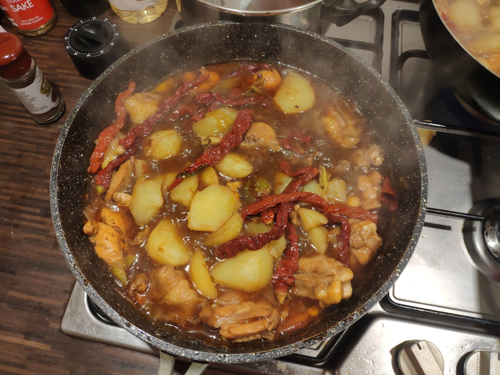

1. 加入蒜和青椒。继续煮5分钟左右。

    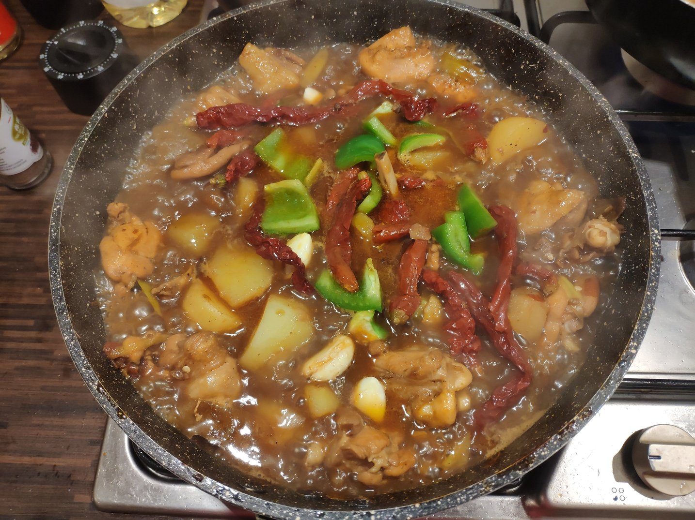

1. 出锅。

    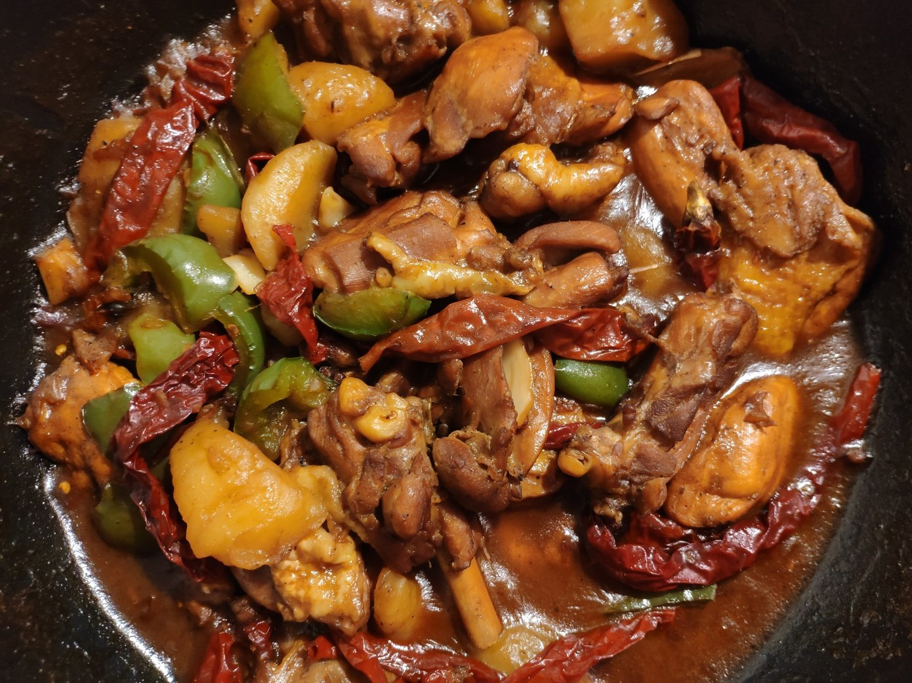

## 要领

- 准备工作比较多，提前腌肉、切菜、炒糖色。

- 不用大火，从炒到炖几乎全程中火或小火。

- 收汁不用收太干，汤汁粘稠且土豆略微溶化时即可出锅。

## 参考

- [【国宴大师•大盘鸡】北京最热门新疆餐厅厨师教做地道新疆名菜，师承新疆大盘鸡创始人，绝对正宗__老饭骨](https://www.youtube.com/watch?v=TyHP0vlzZUI)
