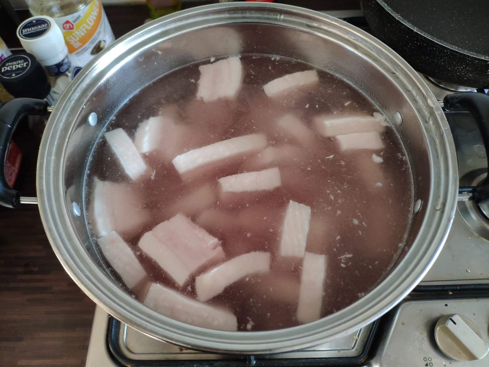
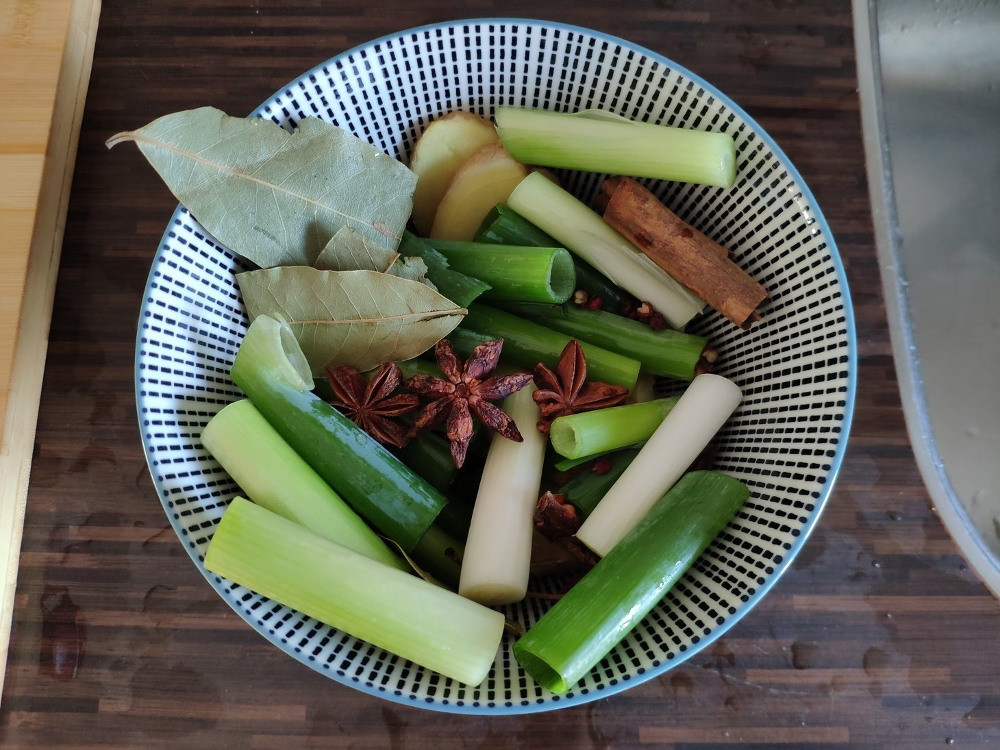
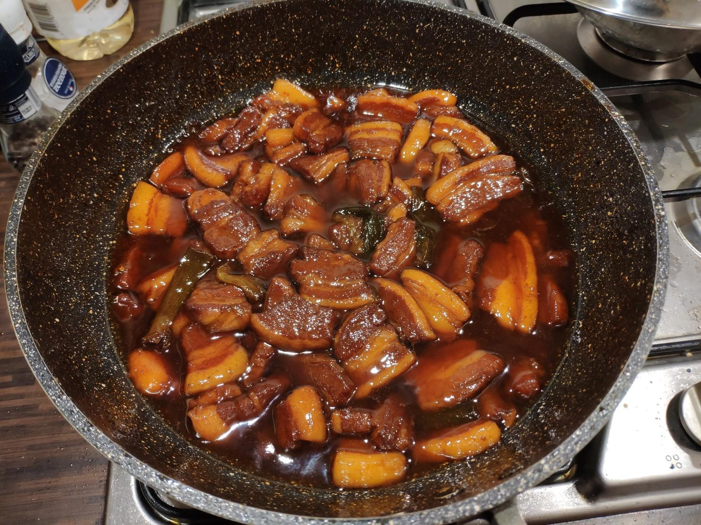

# 红烧肉

## 食材

五花肉

## 调料

小葱，姜，大料，香叶，桂皮，花椒，白胡椒，生抽，老抽，料酒，盐，糖

## 步骤

1. 五花肉切块，[焯水](../技巧/焯水.MD)。

    

1. 趁焯水的工夫，准备调料。小葱切段，姜切片。准备一小碗，放入6味料：葱、姜、大料、香叶、桂皮、花椒。

    

1. [炒糖色](../技巧/炒糖色.MD)。开炒同时可以烧一壶热水。

1. 五花肉加入炒好的糖色中，搅拌，注意不要让焦糖结块。

1. 加入六味调料。加生抽、老抽、料酒。

1. 继续翻炒一段时间，尽量给肉挂上颜色，但也不要把肉炒老。

1. 加烧开的热水，没过肉即可。此时汤汁应为枣红色，颜色不够可以加老抽。加少量白胡椒粉去腥，先不加盐。

1. 大火盖盖煮15分钟。

1. 15分钟后，加盐和白糖调味，糖比盐略多。喜欢重口味可以多加。（也可以高压锅出来后再调味）

1. 全部倒入高压锅，煮25-30分钟。（加上气和放气过程可能要用1小时）

1. 高压锅煮完后，倒入炒锅，开大火。此时可（再次）加盐和糖调味。

1. 大火烧开收汁10-15分钟，期间把多余调料捡出避免影响口感，完毕。

## 要领

- 高压锅要消耗一小时，但它可以真正把味道压进肉里，做完后肉是Q弹的，入口即化，省去高压锅步骤直接收汁的话肉不入味。

## 参考

- [【国宴大师•红烧肉】最正宗的红烧肉Chinese Braised pork，酱香软糯，香而不腻，这样做简单又好吃 |老饭骨](https://www.youtube.com/watch?v=vs98GFHlXVg)
