# 老北京打卤面

## 食材

香菇，黄花，木耳，五花肉，鸡蛋

## 调料

盐，大料，大葱，姜，生抽，老抽，蚝油，料酒，淀粉，花椒

## 步骤

1. 取木耳和黄花菜装盆，取香菇装盆，分别加冷水泡2小时（若时间有限可加热水泡30分钟）。

    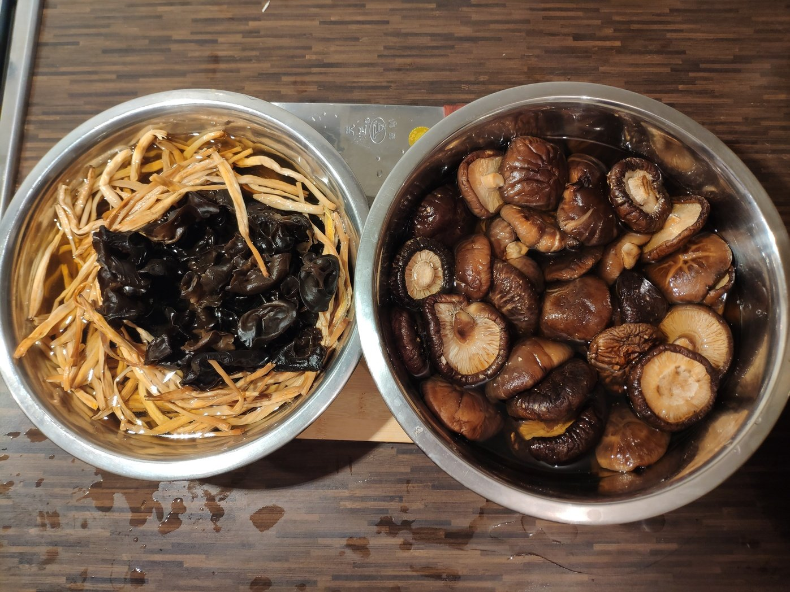

1. 2小时后，取出泡好的食材，水不要扔。把香菇切条，五花肉切片，同时备好葱花、姜片。食材准备就绪。

    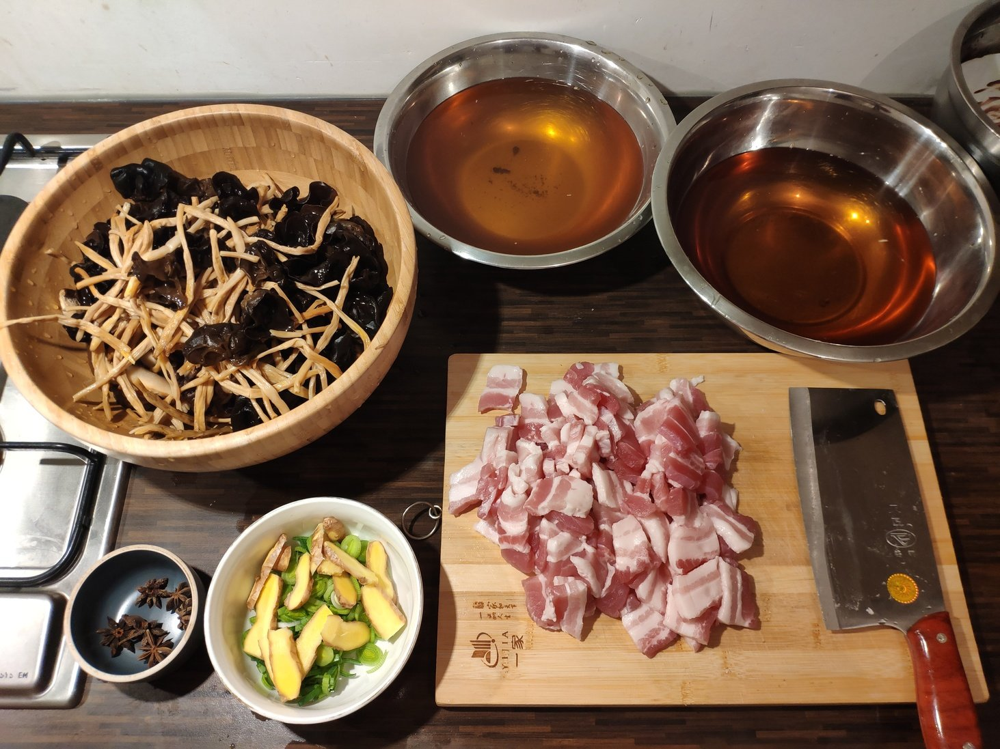

1. 热锅热油炒葱花姜片爆香，然后加入五花肉。加大料、料酒、蚝油、生抽和较多老抽，翻炒均匀至断生。

    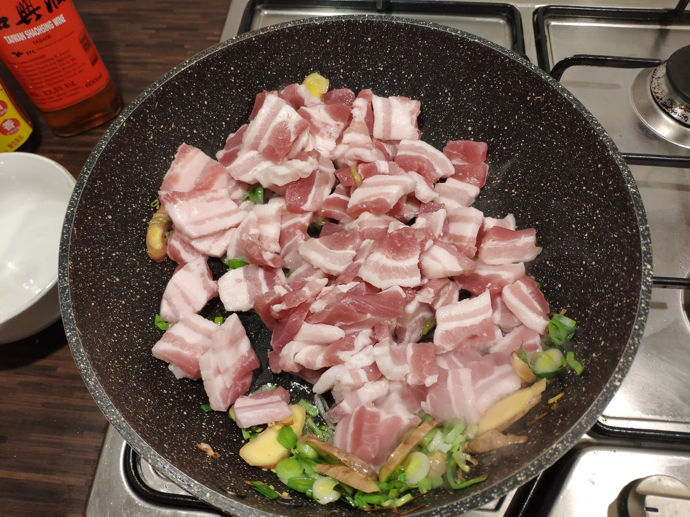

    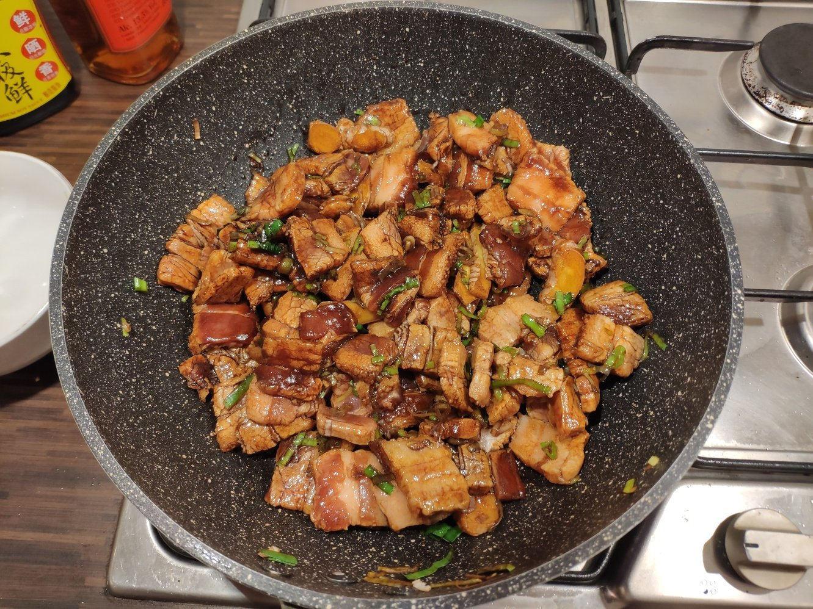

1. 加入香菇、黄花菜和木耳，加较多盐翻炒均匀。

    

1. 加泡香菇剩下的香菇水至没过食材，大火烧开后可调味，盐要加够，卤没咸味儿味道不好。

    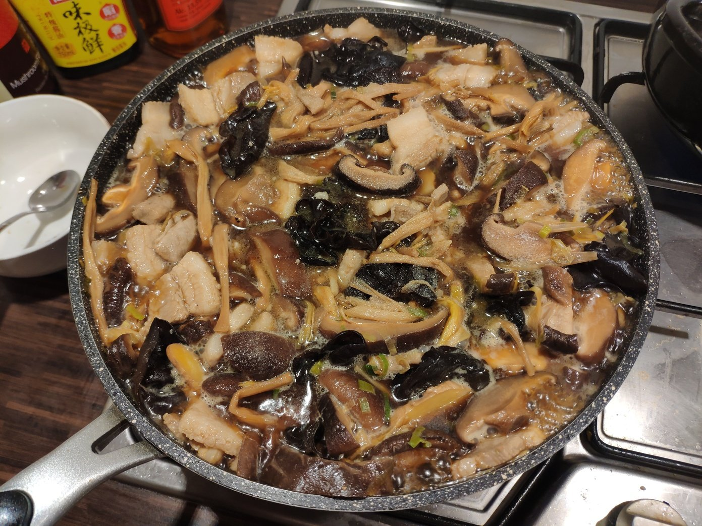

1. 中小火盖盖焖20-30分钟。

    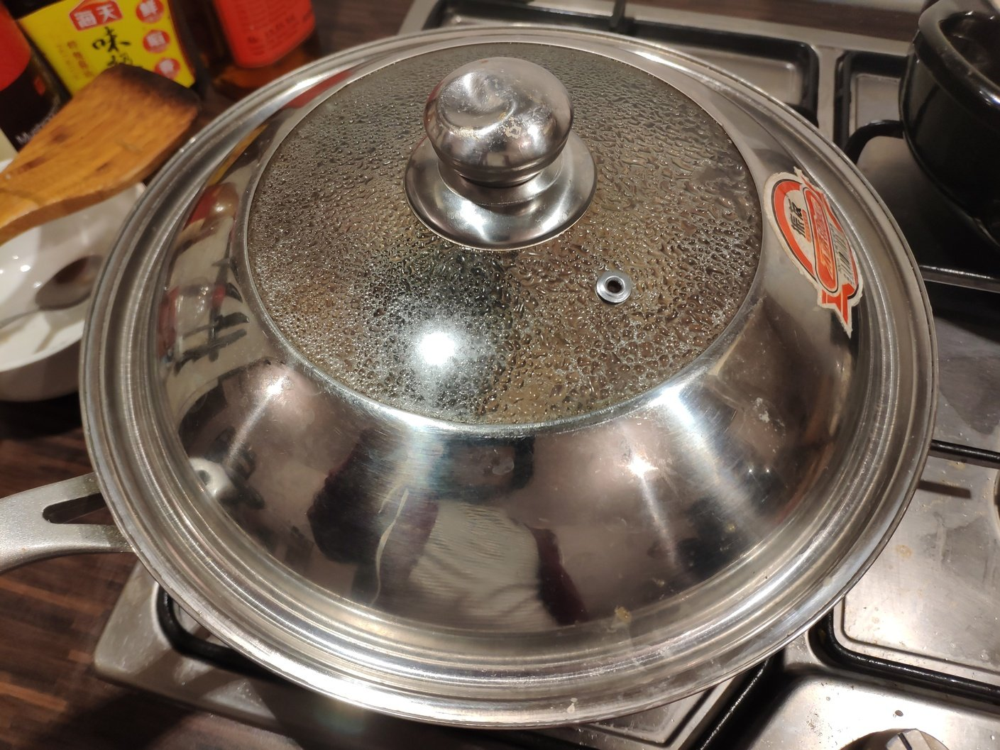

1. 焖的时候准备一小碗淀粉，加水搅拌均匀。再打几个鸡蛋。

    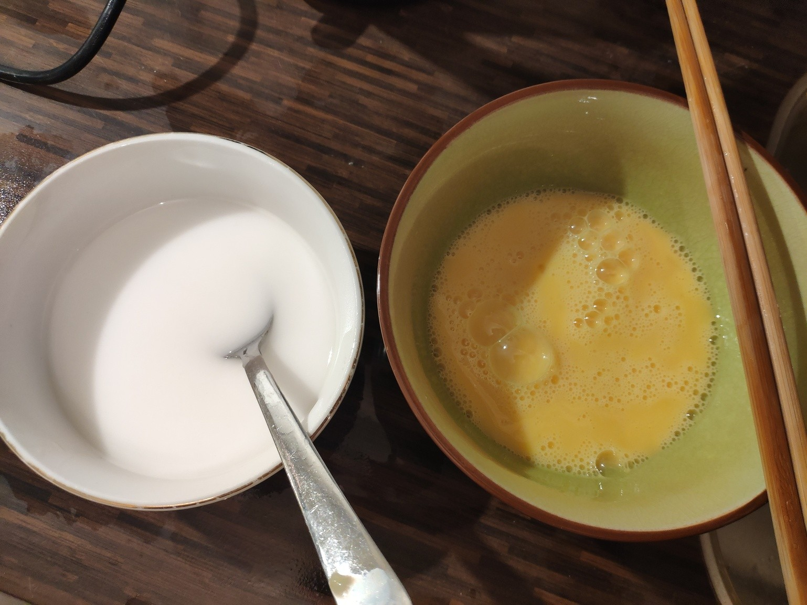

1. 焖完后，加入淀粉水，立刻搅拌以免形成面疙瘩。淀粉的量如果控制不好可以先少加一点，如果汤汁儿仍然太稀就继续加。最后汤汁应该是浓稠挂勺的。

    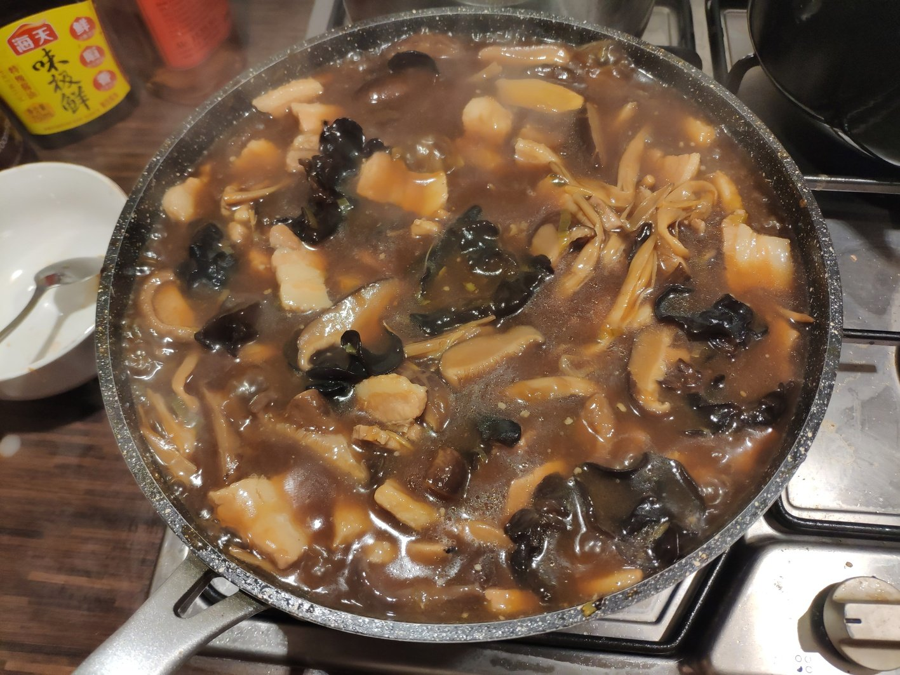

1. 加入打好的鸡蛋，保持中火即可煮几分钟即可，不要搅拌以免打散蛋花。

    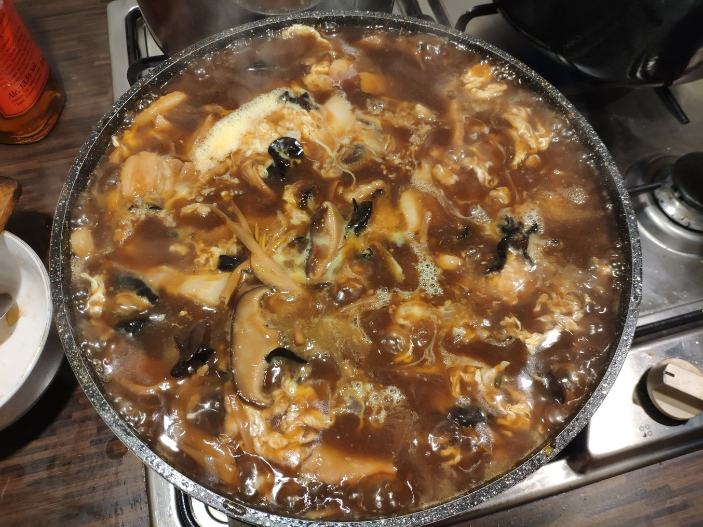

1. 另起锅或用汤勺烧热少量油，加入花椒变成花椒油，泼在卤上。

    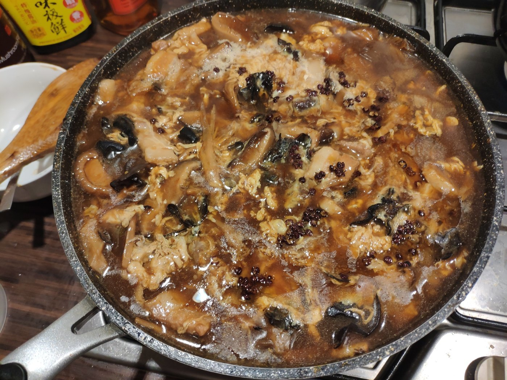

1. 将花椒捡出以免影响口感，出锅。

    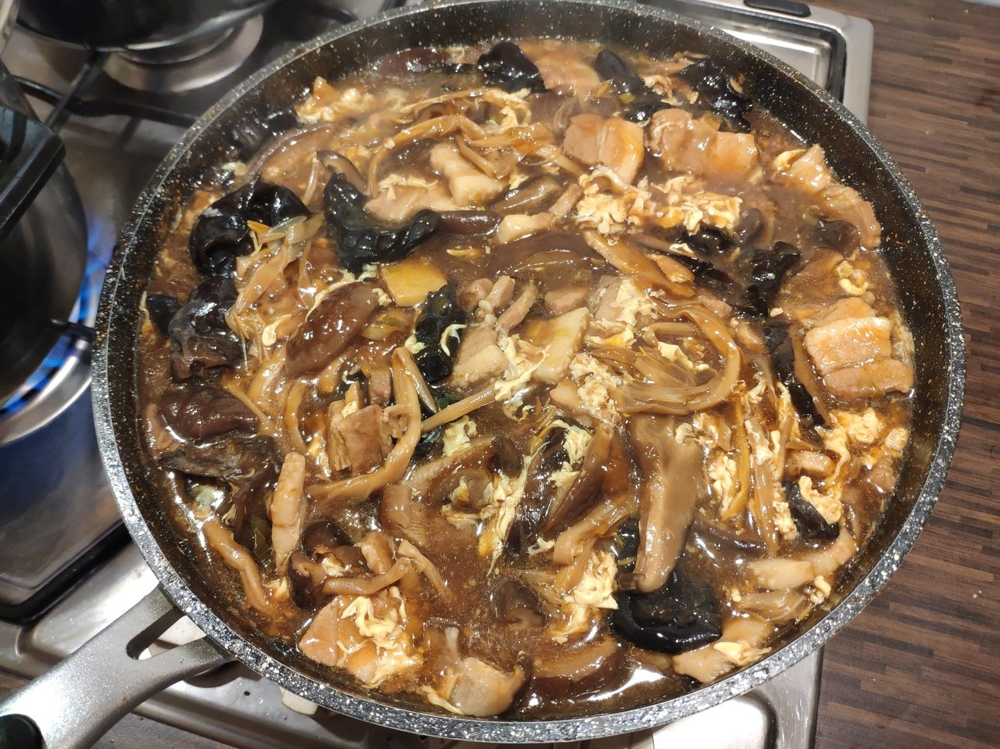

## 要领

- 加水时一定要用香菇水，不够的话也可加黄花木耳水，不要用清水。

- 先勾芡再加鸡蛋，顺序不能反。

## 参考

- 家传技能 :D
