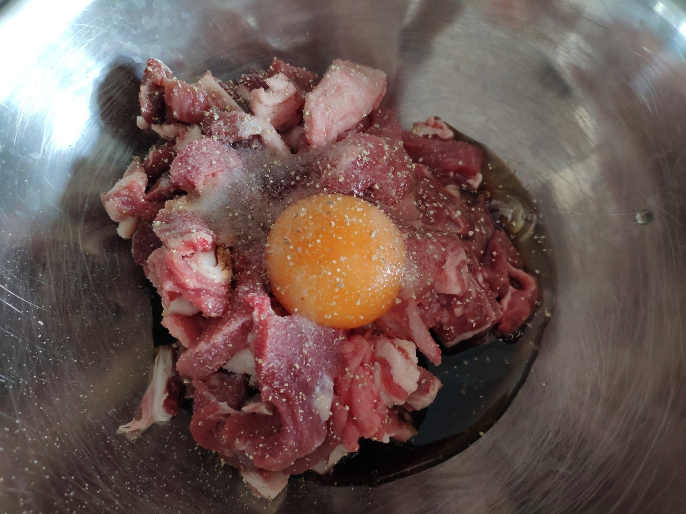
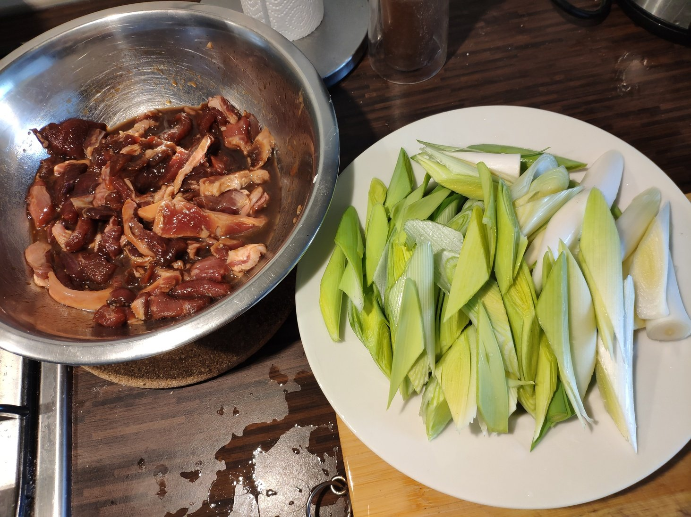
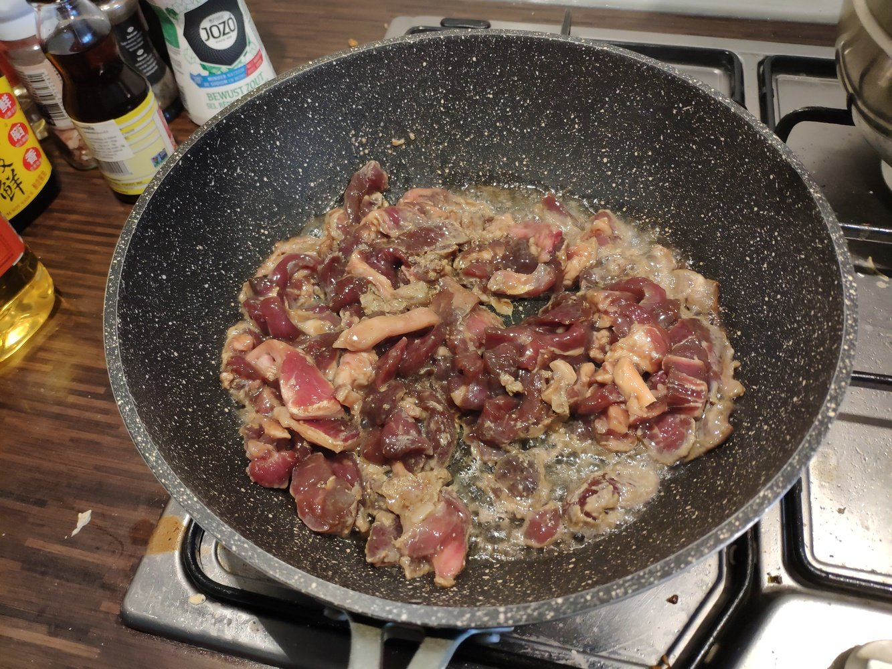
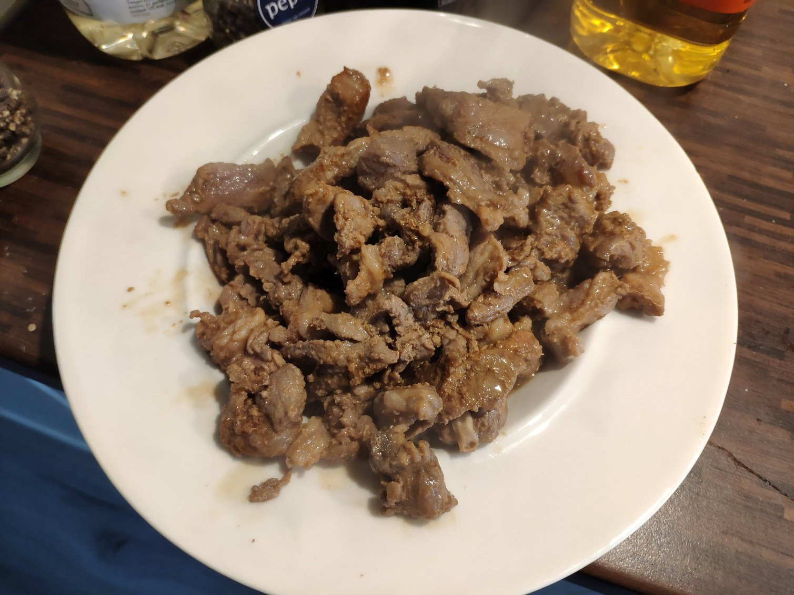
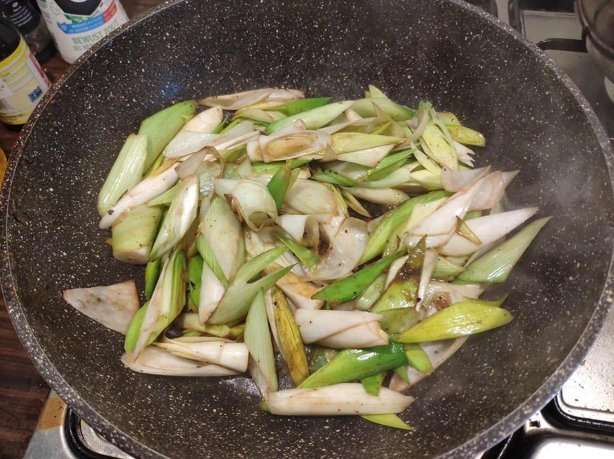
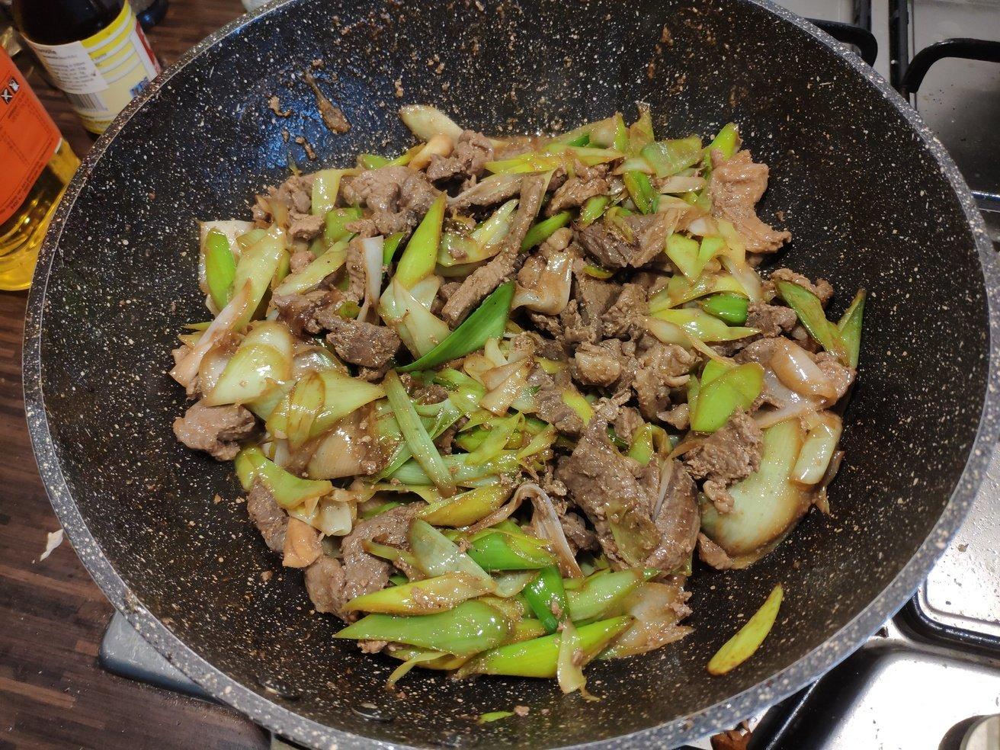
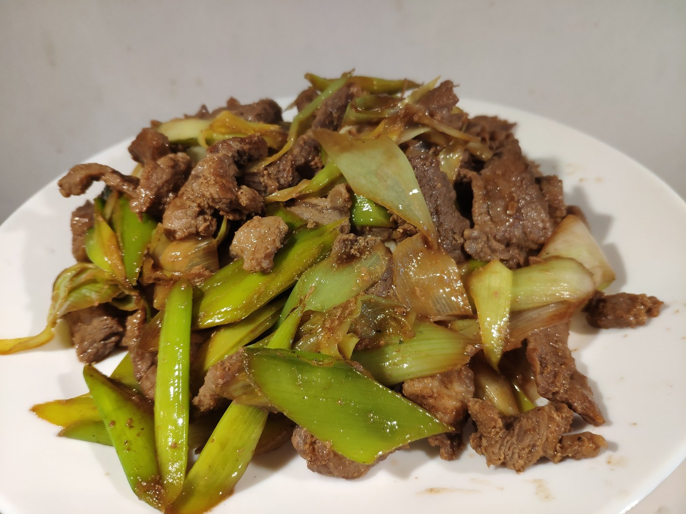

# 葱爆羊肉

## 食材

羊肉，大葱

## 调料

盐，生抽，老抽，鸡蛋，香油，料酒，醋

## 步骤

1. 羊肉切片，开始码味儿。加生抽、老抽、一个鸡蛋、白胡椒、料酒、较多香油、少量盐，腌制数十分钟。

    

1. 大葱切成滚刀块。食材准备就绪。

    

1. 开火，把锅烧热烧出锅气。下油，同样烧热。葱爆羊肉讲究用高温“爆”。

1. 倒入腌好的羊肉翻炒，不需要加调料，断生后盛出装盘。

    

    

1. 再次下油烧热，放入大葱，加料酒、生抽、老抽，翻炒。

    

1. 葱炒到一定火候后倒入羊肉，此时可再补些盐，翻炒均匀，最后淋少量醋，出锅。

    

    

## 要领

- 锅一定要烧热，用大火爆，不宜小火炒太久。

## 参考

- [【国宴大师•葱爆羊肉】老北京教你地道京菜，羊肉（Scallion lamb）鲜嫩爽滑，没有膻味全靠这一招！ |老饭骨](https://www.youtube.com/watch?v=DmafXVqOTnw)
