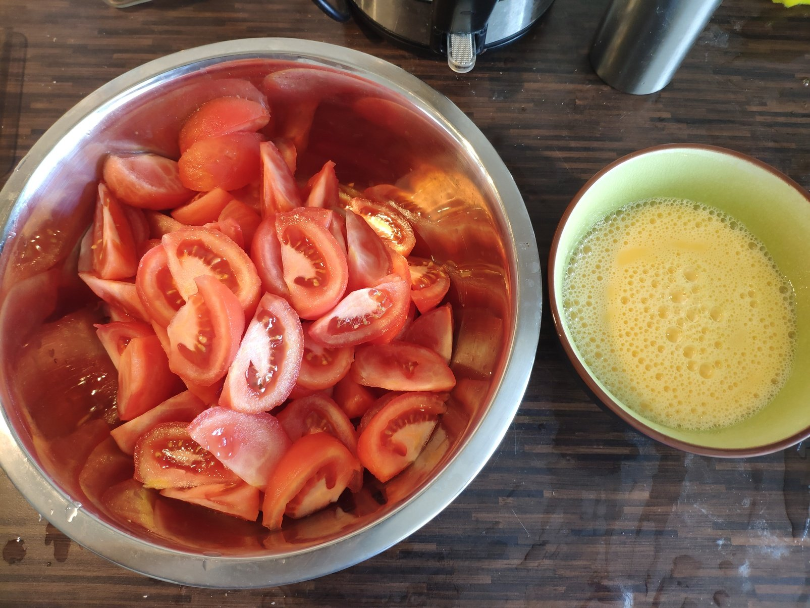
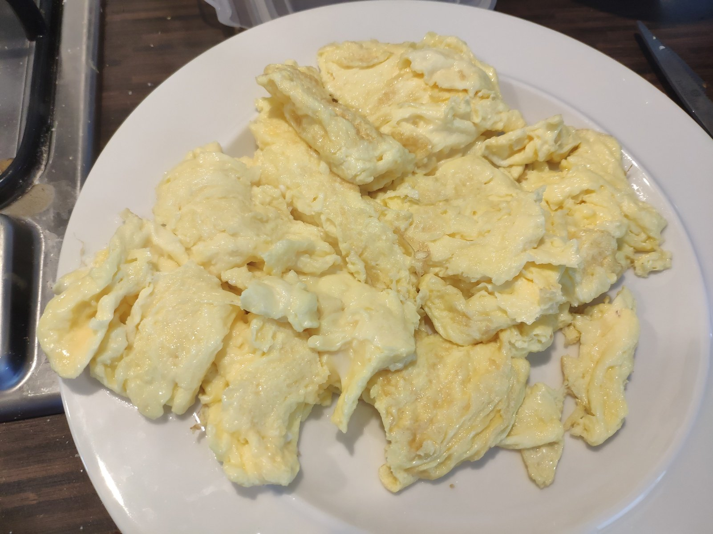
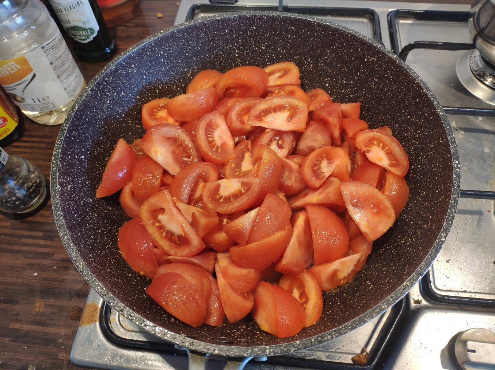
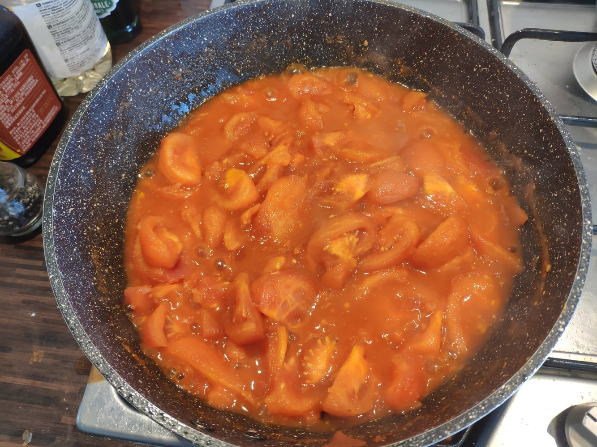
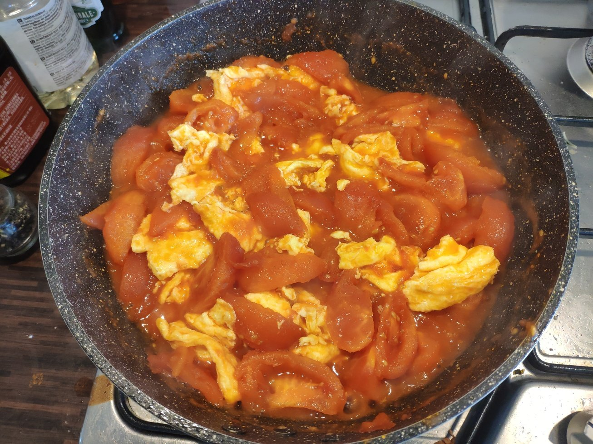
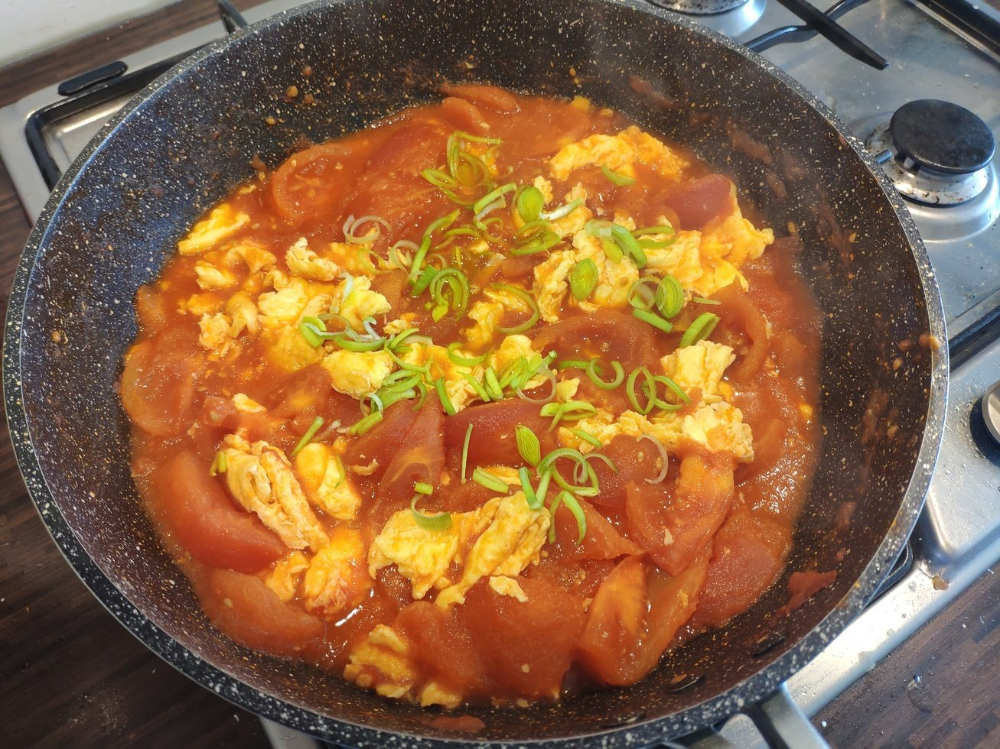

# 西红柿鸡蛋

## 食材

西红柿，鸡蛋

## 调料

小葱，盐，生抽，香油，白糖

## 步骤

1. 西红柿冷水下锅，烧水煮，皮出褶后用凉水冲，剥皮。
去皮不仅仅是为了提升口感，不去皮的话在炒西红柿时表皮会影响西红柿受热，影响味道。

1. 打鸡蛋，不加盐。食材准备就绪。

    

1. 热锅热油下鸡蛋，不要搅拌太碎。可以炒到略微老一点，盛出来备用。

    

1. 少量油，下锅炒葱花和西红柿。

    

1. 放一点点生抽提鲜，放少量白糖提鲜，放盐。

1. 炒出大量汁水、西红柿变软烂后，加鸡蛋搅拌。

    

    

1. 可加少量香油和葱花，出锅。

    

    

## 要领

- 西红柿要去皮。

- 酱油不要加多。

## 参考

- [【国宴大师•西红柿炒蛋】新手必学，咸甜口的西红柿炒蛋，炒出滑嫩多汁 |老饭骨](https://www.youtube.com/watch?v=lZlxOoIpm1Q&t=256s)
